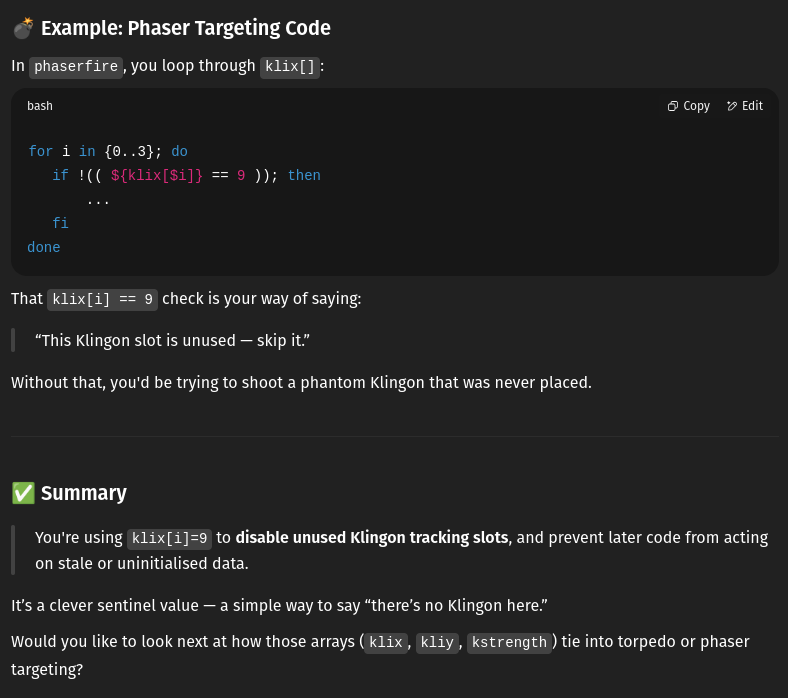

# Bash Trek

<p align="center">
  
</p>

A Bash implementation of the old terminal game *Star Trek*, a simple turn-based game of strategy.

## Requirements

- Bash >= 4.3
- A UTF-8–capable, ANSI / VT100-compatible terminal emulator (eg GNOME Terminal, Konsole, Tilix)
- `tput` - for terminal control / colours
- `sleep` - for timing and animation

## Notes

Although it was written from scratch, this implementation of *Star Trek*, like versions I've written previously in C and BBC BASIC is based on a Commodore PET version I encountered in the early '80s. However it contains a number of new enhancements including:

- Wormholes
- Unpredictable Klingon response behaviour
- Quadrant caching
- Intelligent object distribution
- Variable Klingon weapon power based on sustained damage
- Torpedo animation
- Fetish-level optimisation

Unlike the old PET version, this one is time-limited (this is a common feature in the various versions of *Star Trek*).

## Installation

Download the script directly:

```bash
wget https://github.com/StarShovel/bash-trek/raw/main/bashtrek.sh
chmod +x bashtrek.sh
```

Alternatively, clone the full repository:

```bash
git clone https://github.com/StarShovel/bash-trek.git
cd bash-trek
```

## Usage

Run the game from the command line:
```./bashtrek.sh```

It's intended to run on a terminal with a dark background.

**IMPORTANT**: start the game in a terminal with dimensions 60x22 minimum. Most terminal emulators have a default of 80x24, and that will work nicely. Resizing while the script is running will break the game spectacularly.


## Instructions

*Bash Trek* is a turn-based strategy game. The object is to destroy all of the Klingons in the galaxy by finding them, then engaging them with phaser and torpedo fire.

The following commands are available to the player:

**NAV** - navigate (move) the Enterprise in a specified direction, by a specified number of places (warp)

**PHA** - use a specified quantity of the ship's energy to fire phasers. Any / all Klingons in the local quadrant will suffer shield damage and may be destroyed.

**TOR** - fire a photon torpedo in a specified direction. If the torpedo collides with a Klingon, it will be destroyed

**SHI** - adjust energy allocated to shields, to the specified figure

**SRS** - display short range scan - showing positions of objects in the local quadrant

**LRS** - long range scan - information on adjacent quadrants will be displayed and stored in the ship's map data

**MAP** - display galactic map data

**RES** - resign command and accept mission failure

The ship's command interface will only allow valid commands (and numeric values where requested) to be typed. Note especially that if the viewer is in short range scan mode, you won't be able to type 'SRS'. The same applies for long range scan / 'LRS'.

### Navigation

The galaxy which is in effect the game's "board" is a set of 64 quadrants arranged in an 8x8 grid. Each quadrant has 64 positions, again presented as an 8x8 grid. The game's environment is therefore a 64x64 position grid and the Enterprise can travel up to a maximum of 63 steps in one of seven directions (diagonally or horizontally / vertically). Conceptually, the same as a queen's move in chess.

When the NAV command is issued, the command interface will prompt for the direction in the form of a digit [0-7]. Each digit represents a direction as follows:

<p>
  
</p>

You'll then be prompted for the distance you want to travel (or "warp"). Note that the ship's astro-navigation system will not permit you to enter an invalid distance.

If navigation in a particular direction is constrained by an obstacle (star, Klingon, wormhole  or starbase) in the present quadrant, the available range will be shown in yellow (to indicate the distance to the obstacle) - as shown below, where the player has selected '2' (right) as the ship's direction. The ship's path is obstructed by a star four positions away.

<p>
  
</p>

Note that if a wormhole (see *Wormholes* below) were at the same position rather than a star, the command interface would allow you to enter a '4' - to enter it.

You can't leave the galaxy - the astro-navigation system won't permit the necessary warp value to be entered.

***Wormholes***

From time to time a wormhole may appear in the present quadrant. These are time-limited (ie liable to collapse after a short time). If the Enterprise enters a wormhole, it will reappear at a different location in the galaxy. It is not possible to predict the destination. In the example shown below, a wormhole has appeared at position 2,1 in the present quadrant.

<p>
  
</p>

### Scanners

The Enterprise has short and long range scanning systems. A **short range scan** displays objects detected in the present quadrant, as shown in the images used to illustrate the **Navigation** section above. A short range scan will be performed automatically when the Enterprise enters a new quadrant, or can be activated (if not already active) by using the SRS command.

A **long range scan** can be performed by use of the LRS command. This acquires and displays information about quadrants adjacent to the local quadrant. The acquired information is used to update the ship's galaxy map, which can be viewed using the MAP command. In the long range scan shown below, the Enterprise is in quadrant 1,1 with three stars. Quadrant 1,2 contains two Klingons and four stars. A starbase has been detected in quadrant 2,0 (indicated by the '1' in '012'). The local quadrant is always shown centred in the scan display.

<p>
  
</p>

### Combat

On entering a quadrant in which one or more Klingons are present, the Enterprise will come under fire. In the event that damage sustained overcomes the energy presently assigned to the shields, the ship will be destroyed. Every incoming weapon strike will degrade shield power, but this can be adjusted from energy reserves by means of the SHI command.

You have two weapons at your disposal, phasers and (photon) torpedoes. In the *Star Trek* terminal game universe, phasers are not a targeted weapon but will damage the shield strength of any enemy vessel present in the quadrant, potentially to the point of destroying it. A direct hit with a torpedo will reliably destroy a Klingon - but these can be fired only in the "queen's move" directions also used by the navigation function (see **Navigation** above).

### Starbases

Two starbases are present in the galaxy. Docking with a starbase is achieved by navigating to an adjacent position. Doing so will replenish torpedo, shield and energy supplies to their default values (10, 500 and 1500 respectively). Below, the Enterprise is docked to a starbase in quadrant 7,3.

<p>
  
</p>


### Mission Deadline

You must complete your mission to eradicate the Klingon presence in the galaxy by stardate **1314.1**.

### Game Conclusion

The game ends with one of four possible outcomes:

***Mission Success***
All Klingons destroyed

***Mission Failure***

- Player resigns
- Enterprise destroyed
- Failure to complete mission by specified stardate
- Energy supply (including shields) completely depleted


## Author's Technical Note

I started coding *Bash Trek* in 2018 but after a week or two, became distracted by something else. I returned to it in 2025 but was disappointed, though not very surprised, to find that I couldn't read my own code. I enlisted ChatGPT-4-turbo to help me understand it. It did a very good job. A snippet from one of its responses:

<p>
  
</p>

I didn't use it to design or write any of the code, since I wanted to stay on top of that myself. But I used it judiciously for debugging.

*Bash Trek* turned into a sort of obsessive optimisation exercise. Bearing in mind that similar code ran successfully on the computers of the 1970s, there is hardly a need to make it more efficient. But I couldn't help myself. I learned to write programs on a ZX-81 and I've always had a compulsion to make my code as streamlined and efficient as possible. I reworked a lot of the code I'd written in 2018. 

For example: a short range display screen is built by traversing the quadrant grid and taking account of objects in their positions. I store the whole short range scan screen in a string variable so that it can be displayed with a single write(), and so that it can be cached and reused until the data is considered stale.

Here's a problem that kept me entertained for a few hours: the basic flow of the game is as follows: the player issues a command (long range scan, phasers, torpedo, navigate, whatever) then if the Enterprise is in a quadrant occupied by Klingons, each of them fires, resulting in the shield energy being depleted. If it goes below 0, the Enterprise is destroyed.

But here's a wrinkle: what if the Enterprise has energy 0, and incoming Klingon fire decrements the shields exactly to 0? It's highly unlikely, but a remote possibility. In that event, the game would end with the "stranded" condition; the Enterprise dead in space, all energy reserves depleted. That's OK, but to me it seems a bit odd in the middle of a combat situation.

So I decided that the "Klingon response" phase of the game would never leave the Enterprise with exactly zero energy reserves. I decided to do this as follows: if the last Klingon phaser volley leaves the Enterprise on zero, then the first Klingon to fire has another go. Obviously it would be a bit strange just to do this in this one, rare circumstance - so I decided that it would happen randomly, occasionally in any event. And to balance it out, I decided that I'd have one of the Klingons decline to fire, very occasionally.

This turned out to be not merely a solution to a highly unlikely problem, but serendipitously an improvement to the game. It introduced an element of uncertainty to the combat situation; an added risk.

