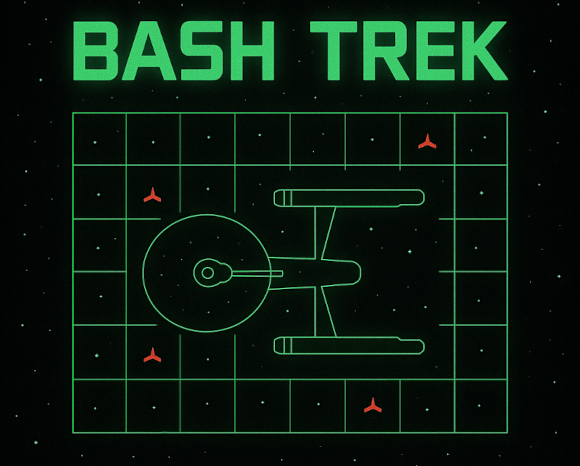

# Bash Trek

<p align="center">
  
</p>

A Bash implementation of the old terminal game *Star Trek*, a simple move-based game of strategy.

## Requirements

- Bash ≥ 4.3
- A POSIX-compatible terminal
- `tput` - for terminal control / colours
- `sleep` - for timing and animation

## Notes

This implementation of Star Trek, like versions I've written previously in C and BBC BASIC is based on a Commodore PET version I encountered in the early '80s. However it contains a number of new enhancements including:

- Wormholes
- Unpredictable Klingon response behaviour
- Quadrant caching
- Intelligent object spacing
- Variable Klingon weapon power based on sustained damage
- Torpedo animation
- Fetish-level optimisation

## Installation

Download the script directly:

```bash
wget https://github.com/StarShovel/bash-trek/raw/main/bashtrek.sh
chmod +x bashtrek.sh
```

Alternatively, clone the full repository:

```bash
git clone https://github.com/StarShovel/bash-trek.git
cd bash-trek
```

## Usage

Run the game from the command line:
```./bashtrek.sh```

For instructions, please refer to bashtrek.pdf. Download by:
```wget https://github.com/StarShovel/bash-trek/raw/main/instructions.pdf```

